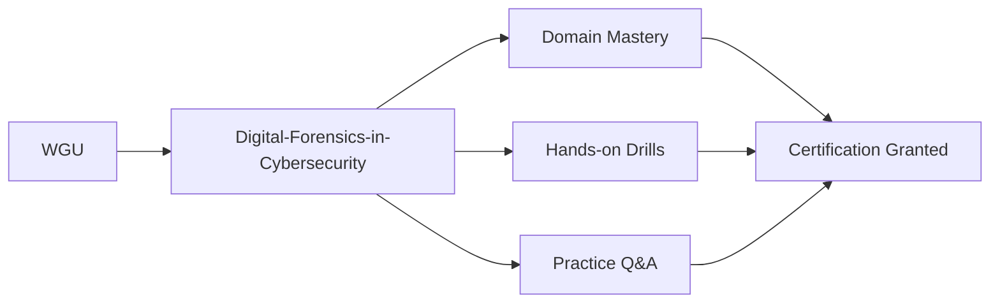

# Digital Forensics in Cybersecurity Certification Reference (`Digital-Forensics-in-Cybersecurity`)

Documentation, domain weighting, and high-quality practice questions for **Digital Forensics in Cybersecurity** from **WGU**.

## Concept Learning Map

## Exam Blueprint & Objectives Table

### Specifications
- **Exam Title**: Digital Forensics in Cybersecurity
- **Exam Code**: `Digital-Forensics-in-Cybersecurity`
- **Vendor**: WGU
- **Exam Duration**: 120 Minutes
- **Number of Questions**: 65
- **Passing Score**: 70%

### Domain Weighting
| Domain / Objective | Weight |
| :--- | :--- |
| Evidence Acquisition & Chain of Custody | 30% |
| Memory & Disk Forensics Analysis | 30% |
| Network & Log Forensics | 25% |
| Legal, Ethical & Expert Witness Guidelines | 15% |

## Technical Demo Practice Questions

Incorporate these 10 technical sample questions into your daily revision routine.

### Question 1
**In the context of Digital Forensics in Cybersecurity, which core objective is emphasized in the domain of Evidence Acquisition & Chain of Custody?**

- A. Standardizing framework principles and applying best-practice operational methodologies
- B. Eliminating all documentation in favor of unverified deployment
- C. Relying exclusively on single-point-of-failure infrastructure
- D. Bypassing governance and compliance audits

**Correct Answer**: `A. Standardizing framework principles and applying best-practice operational methodologies`

**Explanation**: Competency in Evidence Acquisition & Chain of Custody requires mastering industry-standard frameworks, analytical principles, and practical application skills.

---

### Question 2
**Which foundational concept in Digital-Forensics-in-Cybersecurity ensures data integrity and operational reliability across systems?**

- A. Defense-in-depth and structured verification controls
- B. Storing unencrypted passwords in plaintext configuration files
- C. Ignoring audit logs and monitoring alerts
- D. Disabling role-based access control (RBAC)

**Correct Answer**: `A. Defense-in-depth and structured verification controls`

**Explanation**: System stability and data assurance rely on multi-layered verification, role-based controls, and continuous monitoring.

---

### Question 3
**Which methodology or analytical approach is recommended when addressing complex problems within Network & Log Forensics?**

- A. Systematic root-cause analysis and data-driven evaluation
- B. Trial-and-error changes made directly in live operational settings
- C. Ignoring stakeholder feedback and historical performance metrics
- D. Relying strictly on obsolete legacy standards

**Correct Answer**: `A. Systematic root-cause analysis and data-driven evaluation`

**Explanation**: Effective management and engineering in Network & Log Forensics demand empirical analysis, structured problem solving, and evidence-based decision making.

---

### Question 4
**In the context of Digital Forensics in Cybersecurity, which core objective is emphasized in the domain of Legal, Ethical & Expert Witness Guidelines?**

- A. Standardizing framework principles and applying best-practice operational methodologies
- B. Eliminating all documentation in favor of unverified deployment
- C. Relying exclusively on single-point-of-failure infrastructure
- D. Bypassing governance and compliance audits

**Correct Answer**: `A. Standardizing framework principles and applying best-practice operational methodologies`

**Explanation**: Competency in Legal, Ethical & Expert Witness Guidelines requires mastering industry-standard frameworks, analytical principles, and practical application skills.

---

### Question 5
**Which foundational concept in Digital-Forensics-in-Cybersecurity ensures data integrity and operational reliability across systems?**

- A. Defense-in-depth and structured verification controls
- B. Storing unencrypted passwords in plaintext configuration files
- C. Ignoring audit logs and monitoring alerts
- D. Disabling role-based access control (RBAC)

**Correct Answer**: `A. Defense-in-depth and structured verification controls`

**Explanation**: System stability and data assurance rely on multi-layered verification, role-based controls, and continuous monitoring.

---

### Question 6
**Which methodology or analytical approach is recommended when addressing complex problems within Memory & Disk Forensics Analysis?**

- A. Systematic root-cause analysis and data-driven evaluation
- B. Trial-and-error changes made directly in live operational settings
- C. Ignoring stakeholder feedback and historical performance metrics
- D. Relying strictly on obsolete legacy standards

**Correct Answer**: `A. Systematic root-cause analysis and data-driven evaluation`

**Explanation**: Effective management and engineering in Memory & Disk Forensics Analysis demand empirical analysis, structured problem solving, and evidence-based decision making.

---

### Question 7
**In the context of Digital Forensics in Cybersecurity, which core objective is emphasized in the domain of Evidence Acquisition & Chain of Custody?**

- A. Standardizing framework principles and applying best-practice operational methodologies
- B. Eliminating all documentation in favor of unverified deployment
- C. Relying exclusively on single-point-of-failure infrastructure
- D. Bypassing governance and compliance audits

**Correct Answer**: `A. Standardizing framework principles and applying best-practice operational methodologies`

**Explanation**: Competency in Evidence Acquisition & Chain of Custody requires mastering industry-standard frameworks, analytical principles, and practical application skills.

---

### Question 8
**Which foundational concept in Digital-Forensics-in-Cybersecurity ensures data integrity and operational reliability across systems?**

- A. Defense-in-depth and structured verification controls
- B. Storing unencrypted passwords in plaintext configuration files
- C. Ignoring audit logs and monitoring alerts
- D. Disabling role-based access control (RBAC)

**Correct Answer**: `A. Defense-in-depth and structured verification controls`

**Explanation**: System stability and data assurance rely on multi-layered verification, role-based controls, and continuous monitoring.

---

### Question 9
**Which methodology or analytical approach is recommended when addressing complex problems within Network & Log Forensics?**

- A. Systematic root-cause analysis and data-driven evaluation
- B. Trial-and-error changes made directly in live operational settings
- C. Ignoring stakeholder feedback and historical performance metrics
- D. Relying strictly on obsolete legacy standards

**Correct Answer**: `A. Systematic root-cause analysis and data-driven evaluation`

**Explanation**: Effective management and engineering in Network & Log Forensics demand empirical analysis, structured problem solving, and evidence-based decision making.

---

### Question 10
**In the context of Digital Forensics in Cybersecurity, which core objective is emphasized in the domain of Legal, Ethical & Expert Witness Guidelines?**

- A. Standardizing framework principles and applying best-practice operational methodologies
- B. Eliminating all documentation in favor of unverified deployment
- C. Relying exclusively on single-point-of-failure infrastructure
- D. Bypassing governance and compliance audits

**Correct Answer**: `A. Standardizing framework principles and applying best-practice operational methodologies`

**Explanation**: Competency in Legal, Ethical & Expert Witness Guidelines requires mastering industry-standard frameworks, analytical principles, and practical application skills.

---

## Final Review & Practice Materials

Before scheduling your exam, test your knowledge under timed conditions. Check out [Digital-Forensics-in-Cybersecurity prep questions](https://www.certsclub.com) for full practice exams and accurate solution sets.
